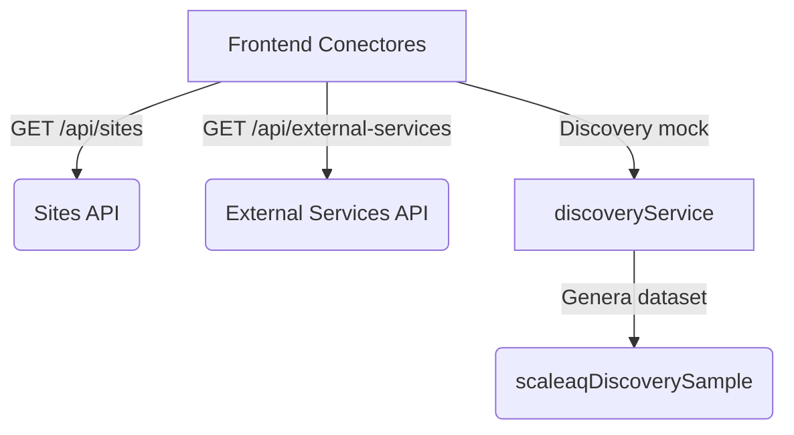

# 📘 Manual de Conectores y Discovery ScaleAQ

Este documento describe el flujo completo de la vista **Dashboard ▸ Conectores** y explica cómo ejecutar el discovery basado en el archivo de ejemplo de ScaleAQ que se incluyó en el proyecto. Úsalo como referencia funcional para demos internas, QA o integraciones futuras.

---

## 1. Panorama general

La pantalla de conectores (reutiliza `frontend/src/pages/Services.tsx`) combina dos bloques:

1. **Tira de centros conectados** – lista todos los sitios (`/api/sites`) y permite enfocarse en uno con un clic.
2. **Panel discovery ScaleAQ** – ejecuta un discovery simulado contra los servicios externos (`/api/external-services`) para mostrar endpoints, headers y datasets basados en el archivo de referencia.

Debajo se mantiene la parrilla de “Servicios Externos” original para registrar/editar credenciales.

---

## 2. Componentes de la UI

### 2.1 Tira de Centros (`sites-strip`)

- Cada “pill” muestra **nombre del centro**, **tenant**, **código interno** y la cantidad de conectores registrados.
- Al hacer clic se expande automáticamente el nodo correspondiente en el árbol y se establece el contexto para el discovery.

### 2.2 Panel de Discovery

- Botón principal **“▶ Ejecutar discovery”**: llama a `discoveryService.runScaleAQDiscovery(site, connectors)`.
- Resumen superior con última ejecución, rango de datos cubierto y totales (series, KPIs).
- Chips con los headers usados (`Scale-Version`, `Accept`) según la configuración almacenada en el conector ScaleAQ.
- Grupos (Meta, Time Series, Feeding, Analytics) renderizan las secciones del archivo de ejemplo, incluyendo tablas y métricas resaltadas.
- El resultado queda cacheado por `siteId` para reabrirlo al cambiar de pestaña sin repetir la llamada.

### 2.3 Árbol por Centro

- Dentro de cada sitio se listan los servicios externos vinculados.
- Para conectores **ScaleAQ** se muestran los headers y el `scaleaq_site_id` configurados.
- Si el conector no es ScaleAQ aparece un “placeholder” que explica que aún no expone discovery.

---

## 3. Cómo ejecutar el discovery

1. Ve a `http://localhost:5173/dashboard/connectors` (o servicios, ambas rutas comparten la vista).
2. Selecciona un centro en la tira superior.
3. Presiona **“▶ Ejecutar discovery”**.
4. Se renderizarán los grupos del archivo demo con:
   - Endpoints agrupados por categoría.
   - Estado de disponibilidad (`ready`, `partial`, `error`).
   - Métricas y tablas con datos de ejemplo.

> **Nota:** Hasta que el backend exponga un endpoint real, el servicio devuelve datos simulados desde `frontend/src/lib/scaleaqDiscoverySample.ts`. La estructura definida en `frontend/src/types/discovery.ts` ayudará a integrar la respuesta real cuando esté disponible.

---

## 4. Endpoints cubiertos en el demo

| Grupo       | Método | Endpoint                                      | Descripción breve                           |
| ----------- | ------ | --------------------------------------------- | ------------------------------------------- |
| Meta        | GET    | `/meta/company?include=all`                   | Info corporativa completa                   |
| Meta        | GET    | `/meta/sites/{siteId}?include=all`            | Ficha detallada del centro                  |
| Time Series | POST   | `/time-series/retrieve`                       | Lecturas crudas por canal                   |
| Time Series | POST   | `/time-series/retrieve/data-types`            | Catálogo de canales y unidades              |
| Time Series | POST   | `/time-series/retrieve/units/aggregate`       | Agregados por unidad de cultivo             |
| Time Series | POST   | `/time-series/retrieve/silos/aggregate`       | Stock y consumo por silo                    |
| Feeding     | GET    | `/feeding-dashboard/units?siteId={siteId}`    | KPIs de consumo/mortalidad                  |
| Feeding     | GET    | `/feeding-dashboard/timeline?siteId={siteId}` | Timeline consolidado de alimentación        |
| Analytics   | GET    | `/analytics/kpis?siteId={siteId}`             | Indicadores operacionales diarios           |
| Analytics   | POST   | `/analytics/export`                           | Exportación CSV con campos del archivo demo |

---

## 5. Flujo técnico

Cuando exista el endpoint real de discovery:

1. `discoveryService.runScaleAQDiscovery` deberá invocar el backend (ej. `POST /api/discovery/scaleaq`).
2. La respuesta debe respetar las interfaces de `types/discovery.ts` para mantener el rendering actual.

---

## 6. Próximos pasos sugeridos

- [ ] Reemplazar el mock por la respuesta real del backend.
- [ ] Soportar múltiples proveedores (Innovex, ProcessAPI) con pestañas.
- [ ] Guardar el timestamp de la última ejecución por centro en la BD.
- [ ] Añadir botón de exportación (PDF/CSV) del discovery.

---

**Última actualización:** Noviembre 20, 2025.
