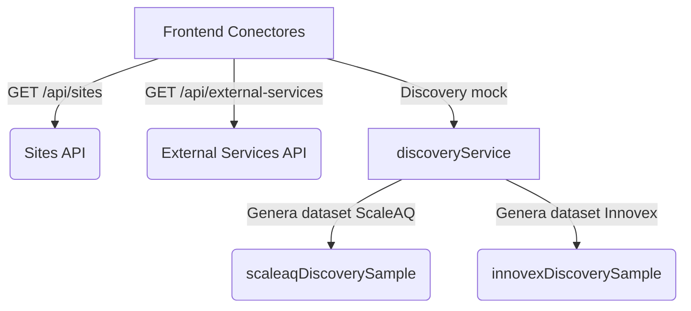

# 📘 Manual de Conectores y Discovery (ScaleAQ + Innovex)

Este documento describe el flujo completo de la vista **Dashboard ▸ Conectores** y explica cómo ejecutar el discovery basado en los archivos de ejemplo de **ScaleAQ** y **Innovex Dataweb** incluidos en el proyecto. Úsalo como referencia funcional para demos internas, QA o integraciones futuras.

---

## 1. Panorama general

La pantalla de conectores (reutiliza `frontend/src/pages/Services.tsx`) combina dos bloques:

1. **Tira de centros conectados** – lista todos los sitios (`/api/sites`) y permite enfocarse en uno con un clic.
2. **Panel discovery multi-proveedor** – ejecuta un discovery simulado (ScaleAQ o Innovex) contra los servicios externos (`/api/external-services`) para mostrar endpoints, headers y datasets basados en los archivos de referencia.

Debajo se mantiene la parrilla de “Servicios Externos” original para registrar/editar credenciales.

---

## 2. Componentes de la UI

### 2.1 Tira de Centros (`sites-strip`)

- Cada “pill” muestra **nombre del centro**, **tenant**, **código interno** y la cantidad de conectores registrados.
- Al hacer clic se expande automáticamente el nodo correspondiente en el árbol y se establece el contexto para el discovery.

### 2.2 Panel de Discovery

- El panel incorpora **tabs** para cambiar entre proveedores (`ScaleAQ` / `Innovex`).
- El botón **“▶ Ejecutar discovery”** ejecuta `discoveryService.runScaleAQDiscovery` o `runInnovexDiscovery` según el tab activo.
- Resumen superior con proveedor activo, última ejecución, rango cubierto y totales (series, KPIs).
- Chips con los headers usados se generan dinámicamente (ScaleAQ muestra `Scale-Version`/`Accept`; Innovex muestra `Authorization`/`Content-Type`).
- Los grupos renderizan las secciones del archivo demo correspondiente (ScaleAQ: Meta, Time Series, Feeding, Analytics. Innovex: Monitors, Últimas lecturas, Rango histórico, Errores).
- El resultado queda cacheado por `siteId + provider` para reabrirlo sin repetir la llamada.

### 2.3 Árbol por Centro

- Dentro de cada sitio se listan los servicios externos vinculados.
- Para conectores **ScaleAQ** se muestran los headers y el `scaleaq_site_id` configurados.
- Para conectores **Innovex** se muestran `monitor_id`, `medition` y un resumen de endpoints disponibles.
- Otros conectores mantienen el placeholder indicando que aún no exponen discovery.

---

## 3. Cómo ejecutar el discovery

1. Ve a `http://localhost:5173/dashboard/connectors` (o servicios, ambas rutas comparten la vista).
2. Selecciona un centro en la tira superior.
3. Elige el tab **ScaleAQ** o **Innovex** según el conector que quieras validar.
4. Presiona **“▶ Ejecutar discovery”**. El botón se deshabilita si el centro no tiene conectores activos para ese proveedor.
5. Se renderizarán los grupos del archivo demo con:
   - Endpoints agrupados por categoría.
   - Estado de disponibilidad (`ready`, `partial`, `error`).
   - Métricas y tablas con datos de ejemplo.

> **Nota:** Hasta que el backend exponga un endpoint real, el servicio devuelve datos simulados desde `frontend/src/lib/scaleaqDiscoverySample.ts` e `frontend/src/lib/innovexDiscoverySample.ts`. La estructura definida en `frontend/src/types/discovery.ts` ayudará a integrar la respuesta real cuando esté disponible.

---

## 4. Endpoints cubiertos en el demo

### ScaleAQ

| Grupo       | Método | Endpoint                                      | Descripción breve                           |
| ----------- | ------ | --------------------------------------------- | ------------------------------------------- |
| Meta        | GET    | `/meta/company?include=all`                   | Info corporativa completa                   |
| Meta        | GET    | `/meta/sites/{siteId}?include=all`            | Ficha detallada del centro                  |
| Time Series | POST   | `/time-series/retrieve`                       | Lecturas crudas por canal                   |
| Time Series | POST   | `/time-series/retrieve/data-types`            | Catálogo de canales y unidades              |
| Time Series | POST   | `/time-series/retrieve/units/aggregate`       | Agregados por unidad de cultivo             |
| Time Series | POST   | `/time-series/retrieve/silos/aggregate`       | Stock y consumo por silo                    |
| Feeding     | GET    | `/feeding-dashboard/units?siteId={siteId}`    | KPIs de consumo/mortalidad                  |
| Feeding     | GET    | `/feeding-dashboard/timeline?siteId={siteId}` | Timeline consolidado de alimentación        |
| Analytics   | GET    | `/analytics/kpis?siteId={siteId}`             | Indicadores operacionales diarios           |
| Analytics   | POST   | `/analytics/export`                           | Exportación CSV con campos del archivo demo |

### Innovex

| Grupo              | Método | Endpoint/Referencia                                                                 | Descripción breve                                              |
| ------------------ | ------ | ----------------------------------------------------------------------------------- | -------------------------------------------------------------- |
| Monitores          | GET    | `/api_dataweb/all_monitors/?active=all`                                             | Lista monitores asociados al cliente con lat/lon y monitor_key |
| Monitores          | GET    | `/api_dataweb/monitor_detail/?monitor_id={id}`                                      | Lista loggers, sensores, jaulas y profundidad                  |
| Últimas lecturas   | GET    | `/api_dataweb/monitor_sensor_last_data/?id={monitor_id}&medition=oxygen`            | Devuelve la última medición de cada sensor                     |
| Últimas lecturas   | GET    | `/api_dataweb/get_last_data/?monitor_id={}&sensor_id={}`                            | Último dato puntual por sensor                                 |
| Históricos         | GET    | `/api_dataweb/get_data_range/?monitor_id={}&sensor_id={}&unixtime_since=...`        | Serie de datos en rango definido                               |
| Históricos         | GET    | `/api_dataweb/monitor_sensor_time_data/?monitor_id={}&medition=oxygen&...`          | Series de hasta 30 días agrupadas por tipo de medición         |
| Errores frecuentes | -      | Tabla del manual (`Unauthorized sensor information`, `Access Denied`, `time out`,…) | Permite anticipar respuestas de error del API Innovex          |

---

## 5. Flujo técnico

Cuando exista el endpoint real de discovery:

1. `discoveryService.runScaleAQDiscovery` y `runInnovexDiscovery` deberán invocar endpoints reales (ej. `POST /api/discovery/{provider}`).
2. La respuesta debe respetar las interfaces de `types/discovery.ts` para mantener el rendering actual.

---

## 6. Próximos pasos sugeridos

- [ ] Reemplazar los mocks por respuestas reales del backend.
- [ ] Exponer discovery para otros proveedores (ProcessAPI, ScaleAQ Cloud directo).
- [ ] Guardar el timestamp de la última ejecución por centro en la BD.
- [ ] Añadir botón de exportación (PDF/CSV) del discovery.

---

**Última actualización:** Noviembre 24, 2025.
